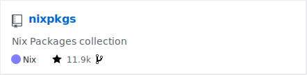

---

title: "Alles Nix"
enableMenu: true
enableChalkboard: false
enableTitleFooter: false
enableZoom: false
enableSearch: true
theme : "blood"
customTheme : "dracula"
transition: "slide"
highlightTheme: "simple"
logoImg: "assets/images/steirernix.svg"
slideNumber: false
separator: '^\r?\n---\r?\n$'
verticalSeparator: '^\r?\n----\r?\n$'
---

# Alles Nix
#### Reproduzierbar, Deklarativ, Zuverlässig


<!-- Notes in standard format are currently rendered as regular text with evilz/vscode-reveal. This is a known bug (https://github.com/evilz/vscode-reveal/issues/295) and the following HTML tag can be used as a workaround. -->

<aside class="notes" data-markdown="">

Before we start, I would like to say that I will mention a couple of concepts, projects and resources for which I will not go into any detail.
Let me assure you that all of them will be listed on the last few slides. Which brings me to the next important point.

</aside>

---

### Follow this live


<a href="https://blog.thym.at/glt23">https://blog.thym.at/glt23</a>

<aside class="notes" data-markdown="">

You can follow the presentation live in your browser and go through the slides in your own pace. The slides will stay avaiable under this URL afterwards as well, so you can go through all of the mentioned resources whenever you feel ready to start your Nix journey.

</aside>

---

## Who am I?

- Student at Graz University of Technology 🎓
- Backend Engineer / Linux SysAdmin 👨‍💻
- Linux Advocate and Avid User of FOSS 🐧
- Daily Driving NixOS since 2019 ❄️

---

## What is Nix? 

Not to be confused with *nix

----

## What is Nix? 

- Nix Language
- Nix Package Manager
- Nix Package Library - Nixpkgs
- Nix Operating System - NixOS
- ...

---

## Nix Language

- Domain-specific
- Purely functional
- Dynamically typed
- Lazily evaluated

<aside class="notes" data-markdown="">

Tutorial for Nix language basics with examples takes about two hours to complete, or less if you have some experience with functional programming languages like Haskell, Racket or Clojure.

Nix comes with an experimental REPL (Read-Eval-Print Loop).

</aside>


----

## Nix Language
### Lazy evaluation

```nix
let
  data = {
   a = 1;
   b = functionThatTakesMinutesToRun 2;
 };
in data.a
```

<aside class="notes" data-markdown="">

In Nix this takes approximately no time to run, becaus the value of "b" isn't actually evaluated until it's needed.

We're creating an attribute set and extract "a" from it. This evaluates to "1" almost instantly, without ever running the code that generates "b".

</aside>


----

## Nix Language

- Used to declare packages and configurations
- Build derivations

<aside class="notes" data-markdown="">

Used to declare packages and configurations to be built by Nix.

</aside>


---

### Building a Nix derivation

```bash
#!/bin/env bash
```


<aside class="notes" data-markdown="">

The rest of this section will just be shown in case the shell demo goes wrong. If everything goes according to plan, we skip the sub-slides by going right.

</aside>


----

### Building a Nix derivation

```nix
{ lib
, stdenv
}:

stdenv.mkDerivation {
  pname = "example";
  version = "1.0";

  dontUnpack = true;

  installPhase = ''
    mkdir -p $out/bin
    cat > $out/bin/linuxtage << EOF
    #!/usr/bin/env sh
    echo "Hello, world! Welcome to Grazer Linuxtage 2023!"
    EOF
    chmod +x $out/bin/linuxtage
  '';

  meta = with lib; {
    description = "An example package";
    license = licenses.unfree;
    maintainers = [ maintainers.totoroot ];
  };
}
```


----

### Building a Nix derivation


```bash
nix-build -E 'with import <nixpkgs> {}; callPackage ./example.nix {}
```

----

### Building a Nix derivation

```bash
λ /nix/store/zgnwkbmr528n6pjw8h1zy3ps9l90myl0-example-1.0/bin/linuxtage
Hello, welcome to Grazer Linuxtage 2023!
```

🎉 🎉 🎉


----

### Building a Nix derivation

```nix
{ lib
, stdenv
, zsh
, hello
}:

stdenv.mkDerivation {
  pname = "example";
  version = "1.0";

  dontUnpack = true;

  installPhase = ''
    mkdir -p $out/bin
    cat > $out/bin/linuxtage << EOF
    #!${zsh}/bin/zsh
    echo "$(${hello}/bin/hello) Welcome to Grazer Linuxtage $(date +'%Y')!"
    EOF
    chmod +x $out/bin/linuxtage
  '';

  meta = with lib; {
    description = "An example package";
    license = licenses.gpl3Plus;
    maintainers = [ maintainers.totoroot ];
  };
}
```

<aside class="notes" data-markdown="">

Tools provided by `stdenv`:

- The GNU C Compiler, configured with C and C++ support.
- GNU coreutils (contains a few dozen standard Unix commands).
- GNU findutils (contains `find`).
- GNU diffutils (contains `diff`, `cmp`).
- GNU `sed`.
- GNU `grep`.
- GNU `awk`.
- GNU `tar`.
- `gzip`, `bzip2` and `xz`.
- GNU Make.
- Bash. This is the shell used for all builders in the Nix Packages collection. Not using `/bin/sh` removes a large source of portability problems.
- The `patch` command.

On Linux, `stdenv` also includes the `patchelf` utility.

</aside>


----

### Building a Nix derivation


```bash
nix-build -E 'with import <nixpkgs> {}; callPackage ./a-very-sophisticated-example.nix {}
```

----

### Building a Nix derivation

```bash
λ /nix/store/sg0g9xlhnb9z0m6yrdykjmqz9dcdvb9b-example-1.0/bin/linuxtage
Hello, welcome to Grazer Linuxtage 2023!
```

😐


---

## Nix Package Library - Nixpkgs




---

## Nixpkgs

### Example package

#### curl's default.nix

```nix
{ lib, stdenv, fetchurl, pkg-config, perl, nixosTests
, brotliSupport ? false, brotli
, c-aresSupport ? false, c-aresMinimal
, gnutlsSupport ? false, gnutls
, gsaslSupport ? false, gsasl
, gssSupport ? with stdenv.hostPlatform; (
    !isWindows &&
    # disable gss because of: undefined reference to `k5_bcmp'
    # a very sad story re static: https://bugs.debian.org/cgi-bin/bugreport.cgi?bug=439039
    !isStatic &&
    # the "mig" tool does not configure its compiler correctly. This could be
    # fixed in mig, but losing gss support on cross compilation to darwin is
    # not worth the effort.
    !(isDarwin && (stdenv.buildPlatform != stdenv.hostPlatform))
  ), libkrb5
, http2Support ? true, nghttp2
, http3Support ? false, nghttp3, ngtcp2
, idnSupport ? false, libidn2
, ldapSupport ? false, openldap
, opensslSupport ? zlibSupport, openssl
, pslSupport ? false, libpsl
, rtmpSupport ? false, rtmpdump
, scpSupport ? zlibSupport && !stdenv.isSunOS && !stdenv.isCygwin, libssh2
, wolfsslSupport ? false, wolfssl
, rustlsSupport ? false, rustls-ffi
, zlibSupport ? true, zlib
, zstdSupport ? false, zstd

# for passthru.tests
, coeurl
, curlpp
, haskellPackages
, ocamlPackages
, phpExtensions
, python3
, tests
, testers
, fetchpatch
}:

# This package is used for bootstrapping fetchurl, and thus
# cannot use fetchpatch! All mutable patches (generated by GitHub or
# cgit) that are needed here should be included directly in Nixpkgs as
# files.

assert !((lib.count (x: x) [ gnutlsSupport opensslSupport wolfsslSupport rustlsSupport ]) > 1);

stdenv.mkDerivation (finalAttrs: {
  pname = "curl";
  version = "8.0.1";

  src = fetchurl {
    urls = [
      "https://curl.haxx.se/download/curl-${finalAttrs.version}.tar.bz2"
      "https://github.com/curl/curl/releases/download/curl-${finalAttrs.version}/curl-${finalAttrs.version}.tar.bz2"
    ];
    hash = "sha256-m2selrdI0EuWh4a2vfQHqlx1q1Oj03wcjIHNtzZVXM8=";
  };

  patches = [
    ./7.79.1-darwin-no-systemconfiguration.patch
  ];

  outputs = [ "bin" "dev" "out" "man" "devdoc" ];
  separateDebugInfo = stdenv.isLinux;

  enableParallelBuilding = true;

  strictDeps = true;

  nativeBuildInputs = [ pkg-config perl ];

  # Zlib and OpenSSL must be propagated because `libcurl.la' contains
  # "-lz -lssl", which aren't necessary direct build inputs of
  # applications that use Curl.
  propagatedBuildInputs = with lib;
    optional brotliSupport brotli ++
    optional c-aresSupport c-aresMinimal ++
    optional gnutlsSupport gnutls ++
    optional gsaslSupport gsasl ++
    optional gssSupport libkrb5 ++
    optional http2Support nghttp2 ++
    optionals http3Support [ nghttp3 ngtcp2 ] ++
    optional idnSupport libidn2 ++
    optional ldapSupport openldap ++
    optional opensslSupport openssl ++
    optional pslSupport libpsl ++
    optional rtmpSupport rtmpdump ++
    optional scpSupport libssh2 ++
    optional wolfsslSupport wolfssl ++
    optional rustlsSupport rustls-ffi ++
    optional zlibSupport zlib ++
    optional zstdSupport zstd;

  # for the second line see https://curl.haxx.se/mail/tracker-2014-03/0087.html
  preConfigure = ''
    sed -e 's|/usr/bin|/no-such-path|g' -i.bak configure
    rm src/tool_hugehelp.c
  '';

  configureFlags = [
      # Build without manual
      "--disable-manual"
      (lib.enableFeature c-aresSupport "ares")
      (lib.enableFeature ldapSupport "ldap")
      (lib.enableFeature ldapSupport "ldaps")
      # --with-ca-fallback is only supported for openssl and gnutls https://github.com/curl/curl/blame/curl-8_0_1/acinclude.m4#L1640
      (lib.withFeature (opensslSupport || gnutlsSupport) "ca-fallback")
      (lib.withFeature http3Support "nghttp3")
      (lib.withFeature http3Support "ngtcp2")
      (lib.withFeature rtmpSupport "librtmp")
      (lib.withFeature rustlsSupport "rustls")
      (lib.withFeature zstdSupport "zstd")
      (lib.withFeatureAs brotliSupport "brotli" (lib.getDev brotli))
      (lib.withFeatureAs gnutlsSupport "gnutls" (lib.getDev gnutls))
      (lib.withFeatureAs idnSupport "libidn2" (lib.getDev libidn2))
      (lib.withFeatureAs opensslSupport "openssl" (lib.getDev openssl))
      (lib.withFeatureAs scpSupport "libssh2" (lib.getDev libssh2))
      (lib.withFeatureAs wolfsslSupport "wolfssl" (lib.getDev wolfssl))
    ]
    ++ lib.optional gssSupport "--with-gssapi=${lib.getDev libkrb5}"
       # For the 'urandom', maybe it should be a cross-system option
    ++ lib.optional (stdenv.hostPlatform != stdenv.buildPlatform)
       "--with-random=/dev/urandom"
    ++ lib.optionals stdenv.hostPlatform.isWindows [
      "--disable-shared"
      "--enable-static"
    ] ++ lib.optionals stdenv.isDarwin [
      # Disable default CA bundle, use NIX_SSL_CERT_FILE or fallback to nss-cacert from the default profile.
      # Without this curl might detect /etc/ssl/cert.pem at build time on macOS, causing curl to ignore NIX_SSL_CERT_FILE.
      "--without-ca-bundle"
      "--without-ca-path"
    ] ++ lib.optionals (!gnutlsSupport && !opensslSupport && !wolfsslSupport && !rustlsSupport) [
      "--without-ssl"
    ];

  CXX = "${stdenv.cc.targetPrefix}c++";
  CXXCPP = "${stdenv.cc.targetPrefix}c++ -E";

  # takes 14 minutes on a 24 core and because many other packages depend on curl
  # they cannot be run concurrently and are a bottleneck
  # tests are available in passthru.tests.withCheck
  doCheck = false;
  preCheck = ''
    patchShebangs tests/
  '' + lib.optionalString stdenv.isDarwin ''
    # bad interaction with sandbox if enabled?
    rm tests/data/test1453
    rm tests/data/test1086
  '' + lib.optionalString stdenv.hostPlatform.isMusl ''
    # different resolving behaviour?
    rm tests/data/test1592
  '';

  postInstall = ''
    moveToOutput bin/curl-config "$dev"

    # Install completions
    make -C scripts install
  '' + lib.optionalString scpSupport ''
    sed '/^dependency_libs/s|${lib.getDev libssh2}|${lib.getLib libssh2}|' -i "$out"/lib/*.la
  '' + lib.optionalString gnutlsSupport ''
    ln $out/lib/libcurl${stdenv.hostPlatform.extensions.sharedLibrary} $out/lib/libcurl-gnutls${stdenv.hostPlatform.extensions.sharedLibrary}
    ln $out/lib/libcurl${stdenv.hostPlatform.extensions.sharedLibrary} $out/lib/libcurl-gnutls${stdenv.hostPlatform.extensions.sharedLibrary}.4
    ln $out/lib/libcurl${stdenv.hostPlatform.extensions.sharedLibrary} $out/lib/libcurl-gnutls${stdenv.hostPlatform.extensions.sharedLibrary}.4.4.0
  '';

  passthru = let
    useThisCurl = attr: attr.override { curl = finalAttrs.finalPackage; };
  in {
    inherit opensslSupport openssl;
    tests = {
      withCheck = finalAttrs.finalPackage.overrideAttrs (_: { doCheck = true; });
      fetchpatch = tests.fetchpatch.simple.override { fetchpatch = (fetchpatch.override { fetchurl = useThisCurl fetchurl; }) // { version = 1; }; };
      curlpp = useThisCurl curlpp;
      coeurl = useThisCurl coeurl;
      haskell-curl = useThisCurl haskellPackages.curl;
      ocaml-curly = useThisCurl ocamlPackages.curly;
      pycurl = useThisCurl python3.pkgs.pycurl;
      php-curl = useThisCurl phpExtensions.curl;
      # error: attribute 'override' missing
      # Additional checking with support http3 protocol.
      # nginx-http3 = useThisCurl nixosTests.nginx-http3;
      nginx-http3 = nixosTests.nginx-http3;
      pkg-config = testers.testMetaPkgConfig finalAttrs.finalPackage;
    };
  };

  meta = with lib; {
    changelog = "https://curl.se/changes.html#${lib.replaceStrings [ "." ] [ "_" ] finalAttrs.version}";
    description = "A command line tool for transferring files with URL syntax";
    homepage    = "https://curl.se/";
    license = licenses.curl;
    maintainers = with maintainers; [ lovek323 ];
    platforms = platforms.all;
    # Fails to link against static brotli or gss
    broken = stdenv.hostPlatform.isStatic && (brotliSupport || gssSupport);
    pkgConfigModules = [ "libcurl" ];
  };
})
```

----

#### Repository Size and Freshness


----

#### In its own class


<aside class="notes" data-markdown="">

Since NixOS is a Linux distributiong built on the Nix Package library, NixOS is known as the most up to date distribution while also being the distribution with the most packages.
All packages in Nixpkgs have been reviewed by a memeber of nixpkgs. For an even larger collection of community package description there is the NUR that are vuilt from source.

</aside>


---

## Nix Package Manager

- For Linux and other Unix systems
    - Yes, that includes macOS
- Makes package management reproducible and reliable

<aside class="notes" data-markdown="">

If, like me, you had to or have to use macOS at work, you might be familiar with homebrew or brew.
While you can get some reproducibility with `brew bundle` by creating and applying a Brewfile or even a Brewfile manager, Nix goes a few steps further.

</aside>


----

## Nix Package Manager

```
nix-env -iA nixos.curl
nix-env -iA unstable.curl
```

<aside class="notes" data-markdown="">

One can use Nix like most other package managers like brew or apt, but this is not very declarative and only with good notes sort-of reproducible.
This is not how we do things on NixOS.

</aside>


----

### Home Manager

```nix
programs.direnv = {
  enable = true;
  nix-direnv.enable = true;
};

home.packages = with pkgs; [
  coreutils
  curl
  wget
];

home.file = {
  ".zshrc".source = ../config/zsh/.zshrc;
};

home.sessionVariables = {
  HOMEBREW_NO_INSTALL_CLEANUP = "TRUE";
};
```


----

### Home Manager

```nix
homebrew = {
  enable = true;
  onActivation = {
    autoUpdate = true;
    upgrade = true;
    # "zap" removes manually installed brews and casks
    cleanup = "zap";
  };
  brews = [
    "cliclick"
  ];
  casks = [
    "alt-tab"
  ];
  taps = [
    # ...
  ];
};
```


---


## What is NixOS? 

- Started as research project by Eeelco Dolstra in 2003
- Took off after first stable release branch in 2013 (13.10)
- Stable releases in May and November (e.g. Raccoon - 22.11)
- Receive bugfixes and security updates for 7 months

<!-- NixOS is a Linux distribution that has been around since 2003 and was started by Eelco Dolstra as a research project. The distribution only really took off after the first stable release in 2013.

On NixOS you can follow several different channels.

There is a stable release of NixOS twice a year in May and November, with a code name like Raccoon and a version number like 22.11 for the November release of 2022.

Every stable release will receive bugfixes and security updates for seven months. -->

<aside class="notes" data-markdown="">

After using stable channels for about a year, I have been using the unstable channel since then and have not really had problems, besides the occasional failing build.

While it is not recommended it is also possible to directly follow the master branch of Nixpkgs.

It features atomic upgrades and rollbacks.

----

## NixOS 

´´´nix
environment.systemPackages = with pkgs; [
  git
  curl
  zsh
  # Modern and intuitive terminal-based text editor
  micro
];
´´´


----

## NixOS 

´´´nix
# Find system disk by nixos label by dedault
fileSystems."/".device = "/dev/disk/by-label/nixos";

# Use the latest kernel by default
boot.kernelPackages = pkgs.unstable.linuxPackages_latest;
´´´


----

## NixOS 

´´´nix
services = {
  # Start a systemd service for each incoming SSH connection
  openssh.startWhenNeeded = true;
  # Enable periodic SSD TRIM to extend life of mounted SSDs
  fstrim.enable = true;
  # Suspend when power button is short-pressed
  logind.extraConfig = ''
    HandlePowerKey=suspend
  '';
};
´´´

<aside class="notes" data-markdown="">

NixOS relies heavily on systemd, but there is experimental support for other init systems.

</aside>


----

## NixOS 

´´´nix
# Take out the garbage every once in a while
nix.gc = {
  automatic = true;
  dates = "weekly";
  options = "--delete-older-than 30d";
};
´´´


---

## Communities

- Discourse
- Matrix
- GitHub
- Discord 😒

<aside class="notes" data-markdown="">

What can you do now when a build for a package or system derivation fails?

</aside>

---

### NixOS User Group Austria

<a class="navigate-right">
    
</a>

<a href="https://nixos.at">https://nixos.at</a>

----

### NixOS User Group Austria

<a class="navigate-right">
    
</a>


----

### NixOS User Group Austria

<a class="navigate-right">
    
</a>


---

## devenv

```nix
{ pkgs, ... }: {
  env.GREET = "Let's get started with";

  enterShell = "echo $GREET Rust";

  languages.rust = {
    enable = true;
    version = "nightly";
  };

  pre-commit.hooks = {
    clippy.enable = true;
    rustfmt.enable = true;
  };

  packages = [ pkgs.delta ];
}
```

---

### Mentioned Resources

#### Nix Language

- [Nix Language Reference](https://nixos.org/manual/nix/stable/language/index.html) - Nix Reference Manual
- [Nix Language Basics](https://nixos.org/guides/nix-language.html) - NixOS Guide
- [Nix REPL](https://nixos.org/manual/nix/stable/command-ref/new-cli/nix3-repl.html) - Nix Reference Manual


----

### Mentioned Resources

#### Nix Package Manager

- [Homebrew Bundle](https://github.com/Homebrew/homebrew-bundle) - GitHub Repository
- [Brewfile Manager](https://homebrew-file.readthedocs.io/en/latest/) - Homebrew-file's Documentation
- [Home Manager Manual](https://nix-community.github.io/home-manager/index.html)
- [Home Manager Option Search](https://mipmip.github.io/home-manager-option-search/)

----

### Mentioned Resources

#### Nixpkgs
- [Tools in stdenv](https://ryantm.github.io/nixpkgs/stdenv/stdenv/#sec-tools-of-stdenv) - Nixpkgs Manual
- [Repository Size and Freshness Graphs](https://repology.org/repositories/graphs) - Repology
- [Nix User Repository - NUR](https://github.com/nix-community/NUR/) - GitHub Repository

----

### Mentioned Resources

#### NixOS

- [NixOS](https://nixos.org/) - Project Website
- [History of Nix/NixOS](https://nixos.org/blog/announcements.html) - Nix Blog Announcements
- [Nix Guide](https://nix.dev/) - Opinionated Guide for Developers
- [NixOS Wiki](https://nixos.wiki/) - Unofficial User's Wiki
- [My Personal Dotfiles](https://codeberg.org/totoroot/dotfiles) - Codeberg Repository

----

### Mentioned Resources

#### Communities

- [Discourse](https://discourse.nixos.org/)
- [Matrix](https://matrix.to/#/#community:nixos.org)
- [IRC](https://web.libera.chat/?nick=Guest?#nixos)
- [GitHub](https://github.com/NixOS/nixpkgs/issues)
- [Discord](https://discord.gg/RbvHtGa)


----

### Mentioned Resources

- [devenv](https://devenv.sh/) - Developer Environments using Nix
- [Awesome Nix](https://nix-community.github.io/awesome-nix/) - Community-maintained link list with helpful resources


---

### Attributions

- Example for lazy evaluation taken from [What is Nix](https://shopify.engineering/what-is-nix) - Shopify


---

# Thanks!

curl -sL [https://matthias.thym.at](https://matthias.thym.at)/card \
\
[https://blog.thym.at/p/glt23](https://blog.thym.at/p/glt23/)
